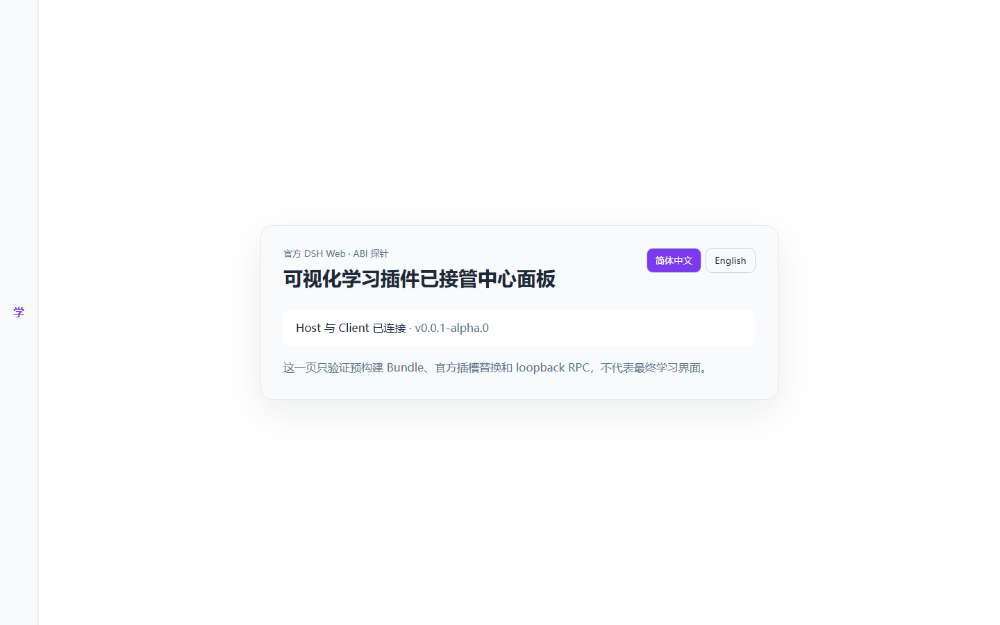
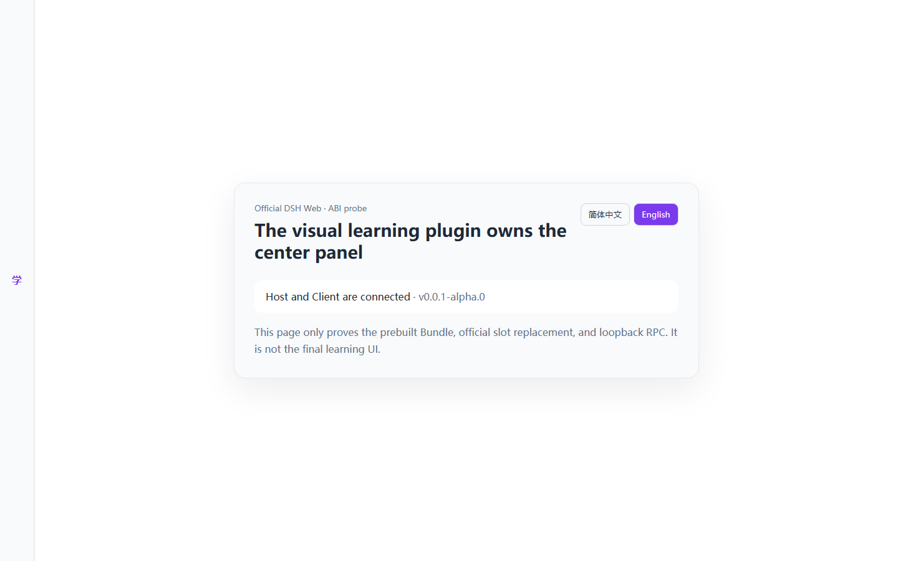
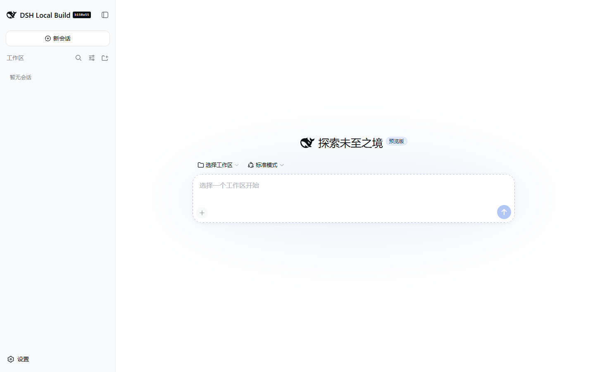

# Official DSH Web Host + Client Bundle ABI Probe

> Date: 2026-08-24  
> DSH: `0.1.1-rc.2` / `b150a551b8d465e31e418e1b2eaf5e79bbb7d28e`  
> Probe package: `@mwangxiang/dsh-visual-learner@0.0.1-alpha.0`  
> Target: official Web Profile only

## Outcome

The prebuilt Bundle probe passed:

- one `.tgz` carries the Host and lazy-CJS Client halves;
- install adds one `dsh-visual-learner` row to the official Web Profile;
- Host boots and answers a loopback-only RPC;
- Client shadows the official `conversation` and `sidebar` single slots with
  priority `-1`, without DOM or CSS hiding;
- native composer and native sidebar are absent from the render tree;
- Simplified Chinese and English both render, switch, and persist across reload;
- uninstall removes the Bundle row and restores the official Web UI;
- a user-owned artifact sentinel remains byte-identical through uninstall.

The probe intentionally does not contain the final learning flow, embedded
Skills, model credentials, or learning-workspace writes.

## Final artifact

| Field | Value |
|---|---|
| File | `mwangxiang-dsh-visual-learner-0.0.1-alpha.0.tgz` |
| Size | `7,582` bytes |
| SHA-256 | `01c922d58d48f2fa29da9e8d58459282ed682612cc757b5fd8010e8e1148bf08` |
| Profile after test | Bundle uninstalled |

The tarball contains only:

```text
package/lib/client.js
package/lib/client.js.map
package/lib/index.js
package/lib/index.d.ts
package/package.json
package/README.md
package/cordis.patch.yml
package/LICENSE
```

## Visual evidence

### Simplified Chinese



### English



### Official UI restored after uninstall



## Build and pack

```powershell
pnpm install --frozen-lockfile
pnpm run typecheck
pnpm run build
pnpm run pack:probe
```

- TypeScript: pass.
- Host output: `lib/index.js` + declarations.
- Client output: `lib/client.js` using the official
  `window.__ModuleLoader__.load({ id, factory })` closure shape.
- The external Client config keeps `react` and `react/jsx-runtime` as injected
  module-table imports. No unpublished official build preset is imported.

## Isolated install and config

An isolated `DSH_HOME` under `.smoke/dsh-home` was used.

```powershell
pnpm dsh plugin --profile web add <absolute-tarball-path>
pnpm dsh --profile web --dump-config
pnpm --dir <isolated-profile> peers check
```

Results:

- install exit `0`;
- dump contains exactly one layer headed `# == @mwangxiang/dsh-visual-learner`;
- `pnpm peers check`: no issues after DSH-provided runtime peers were marked
  optional in package metadata;
- no home-level or user profile was touched.

## Browser smoke

The isolated server ran at `http://127.0.0.1:31888` with `--no-open`. The
tests used the package-local Playwright runtime and did not control an existing
user browser.

```powershell
node scripts/smoke-client-probe.mjs
```

Verified:

- `[data-dsh-visual-learner-probe]` renders;
- Host RPC returns `hostLoaded: true`, protocol `1`;
- no enabled native conversation textarea exists;
- the native DSH sidebar text does not exist;
- the custom sidebar is mounted and the official AppFrame has collapsed it to
  the compact rail;
- `zh-CN → en → reload` preserves English;
- no page errors were emitted.

## Official first-run layers

The Web Profile displays two Host-owned onboarding layers before an ordinary
first run reaches the plugin surface:

1. the official DSH developer-preview notice, which requires explicit
   `Continue / 继续` acknowledgement;
2. the official API-key setup, where the user may select
   `Configure later / 稍后配置`.

The plugin must not silently accept the developer-preview notice. Product
onboarding must account for these two layers rather than promise that the
first visible pixel is always plugin-owned.

## Uninstall and data preservation

A sentinel was created outside the plugin/profile directory:

```text
.smoke/learning-workspace/user-artifacts/KEEP-ME.md
```

Its SHA-256 before and after uninstall was:

```text
94c836969771342e1ed3da60706cff342ca70248438a6eee99321dacd7042400
```

After:

```powershell
pnpm dsh plugin --profile web remove @mwangxiang/dsh-visual-learner
pnpm dsh --profile web --dump-config
node scripts/smoke-uninstall-fallback.mjs
```

- the Bundle row was absent;
- the sentinel hash was unchanged;
- the official sidebar and conversation hero returned;
- the custom visual learner marker was absent.

## Failures that shaped the probe

1. The first pack command wrote to an outer `release/` because `--filter`
   changed path interpretation. The generated tarball was moved into the repo,
   and the command now uses `pnpm --dir` with a verified repository-local
   destination.
2. The first Host boot rejected `dsh-visual-learner/v1`; official RPC channels
   must match `^/[A-Za-z0-9._~-]+$`. The channel is now
   `/dsh-visual-learner-v1`.
3. The first install reported missing peers even though DSH supplies them via
   the profile fallback. Marking the Host-provided peers optional removed the
   misleading pnpm warning; runtime injection still fails loud if DSH omits an
   actual service.
4. The first Client bundle externalized a relative `../protocol.ts`. The probe
   now keeps its tiny wire constants local to each build face, leaving only
   official platform modules as runtime `require()` calls.
5. The initial build emitted `index.mjs` while the manifest exported
   `index.js`. `fixedExtension: false` now pins the expected artifact.
6. Three browser attempts encountered official first-run overlays at different
   times. The final script handles the exact developer-preview and
   configure-later actions, without auto-accepting credentials or warnings.
7. A manual TypeScript check originally exposed three errors that tsdown alone
   did not block. Typecheck is now the first mandatory build step.

## Next probe

Replace the static ABI card with the minimal Guided Learning Appliance state
machine, package the locked Skills, and drive one keyless fixture through:

```text
real problem → one learning step → one performance → evidence → next step
```

The live-provider version remains gated on a user-configured DSH Credential.
